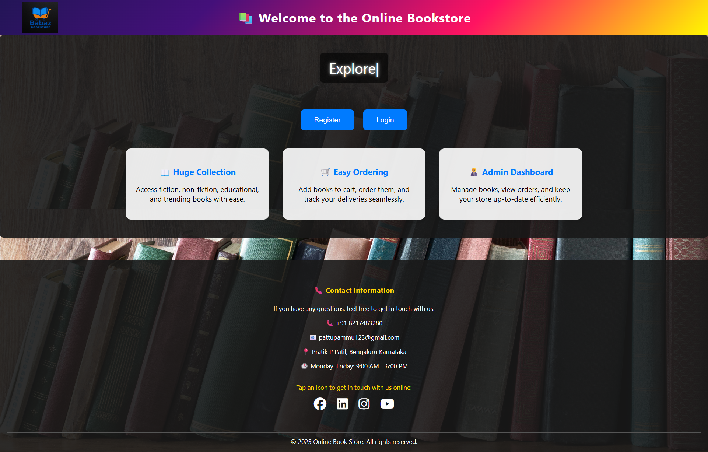
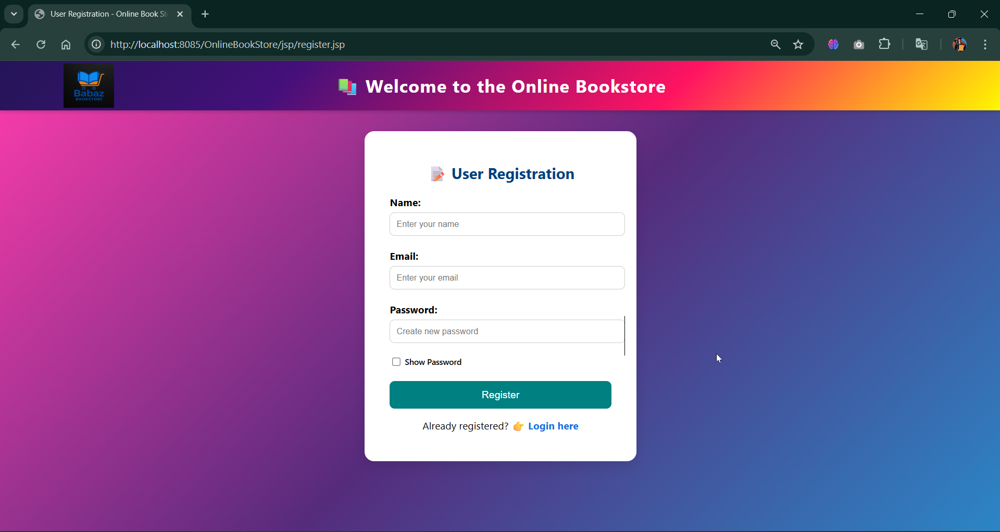
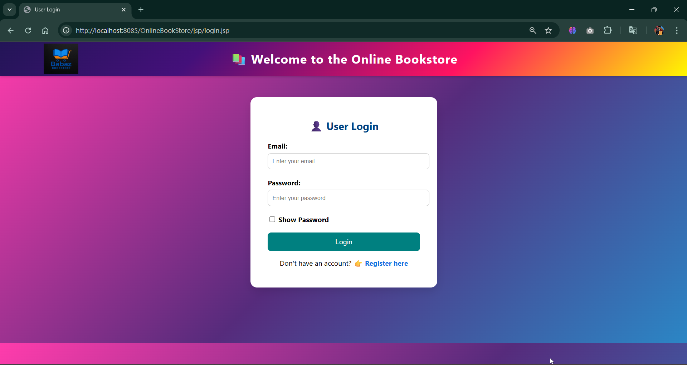
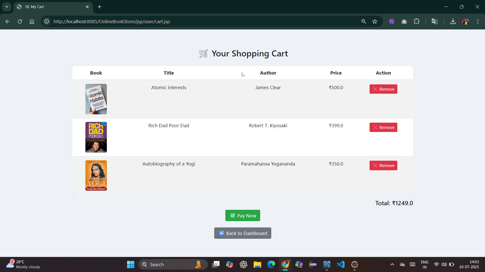
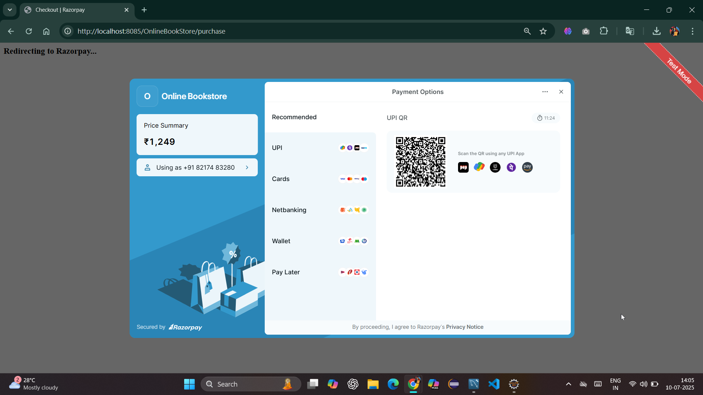
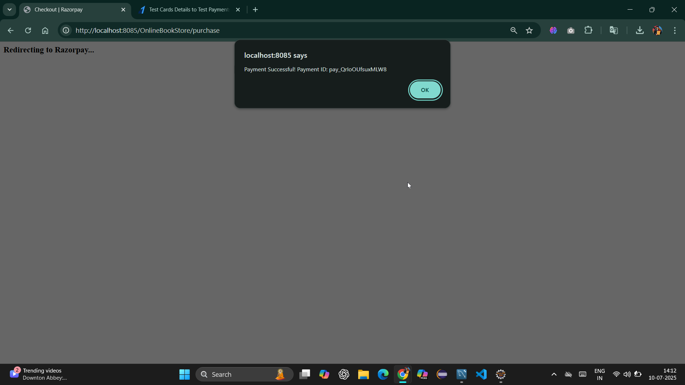
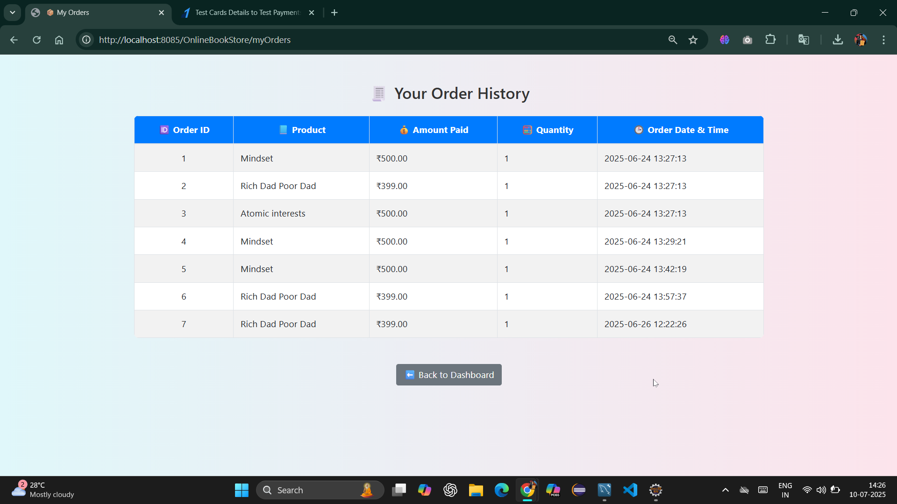
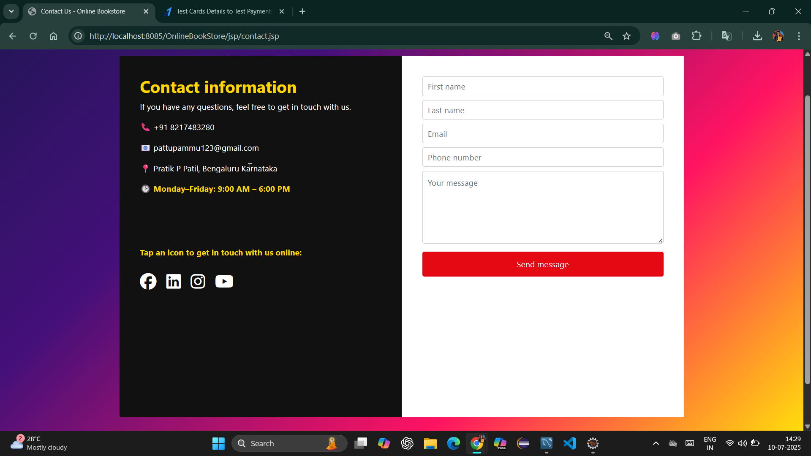
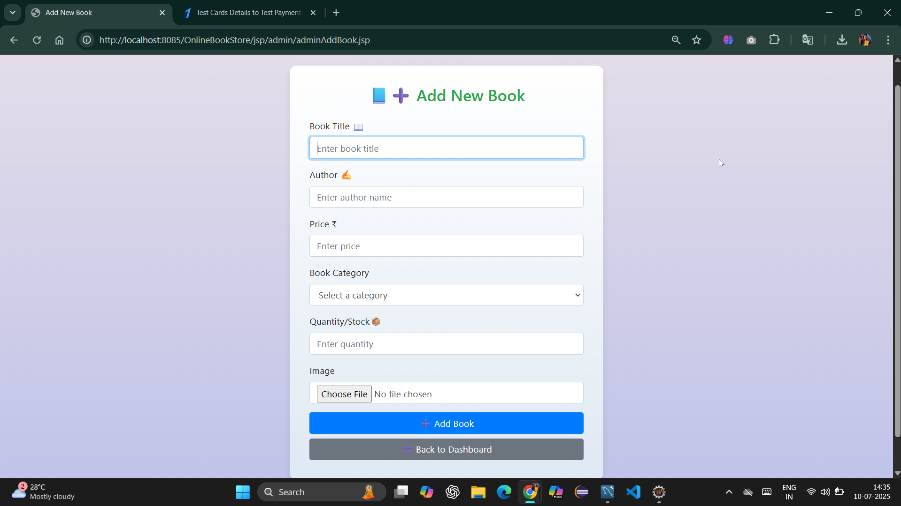
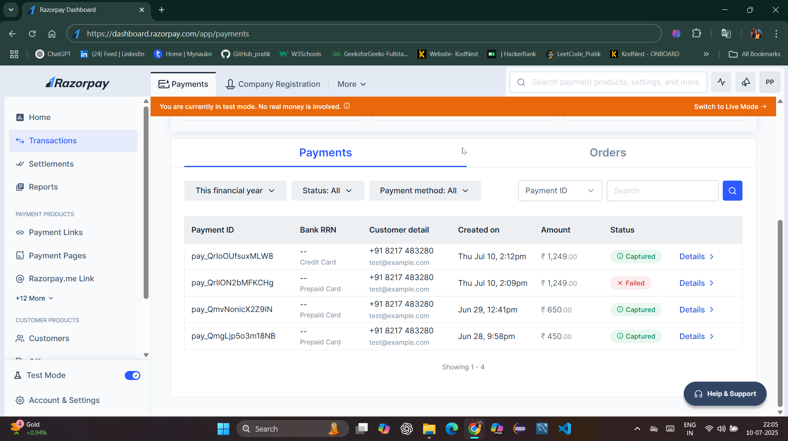

# 🛍️ Babaz Online Bookstore

> A mini eCommerce web application built the traditional way using Java Servlets & JSP, featuring secure Razorpay payment integration and a clean admin/user experience.

Babaz is a fully functional online bookstore where:

- 📚 Users can browse, search, and buy books with a modern UI  
- 🛒 A shopping cart system lets users manage their purchases  
- 💳 Razorpay integration allows mock test payments  
- 🧑‍💼 Admins can manage inventory, orders, and books via a dashboard  

Built with a Java Full-Stack approach — no Spring, no frameworks — just pure Java EE (Servlets + JSP), JDBC, HTML/CSS/Bootstrap, and a MySQL backend.

<p align="center">
  
</p>

---

## 📚 Table of Contents

1. [About the Project](#about-the-project)  
2. [Features](#features)  
3. [Tech Stack](#tech-stack)  
4. [Getting Started](#getting-started)  
   - [Prerequisites](#prerequisites)  
   - [Installation & Running](#installation--running)  
5. [Razorpay Sandbox Testing](#razorpay-sandbox-testing)  
6. [Screenshots](#screenshots)  
7. [Future Enhancements](#future-enhancements)  
8. [Author](#author)  

---

## 🧐 About the Project

**Babaz Online Bookstore** is a traditional Java-based mini eCommerce application that simulates a real-world online bookstore experience.

It is designed to demonstrate:

- Full-stack development using **Java Servlets**, **JSP**, and **JDBC**
- Integration of a **payment gateway (Razorpay)** in **sandbox mode**
- Clean separation between user and admin roles
- CRUD operations via an intuitive **admin dashboard**
- Basic MVC principles using only **core Java technologies** (no Spring or Hibernate)

🧾 Functional highlights:

- 📚 Users can register, log in, browse books, and make test payments
- 🛒 Cart system with add/remove functionality
- 🔐 Admins can add/update/delete books and view all orders
- 📬 A contact form simulates message sending (via local handling)

This project is ideal for those learning Java EE and looking to build a beginner-friendly eCommerce app without heavy frameworks.


---


## ✨ Features

### 👤 User Features
- 🏠 Responsive **Welcome Page** with modern UI
- 📚 View available books as **product cards** with images and titles
- ➕ **Add to Cart** functionality
- 🛒 **Cart page** with quantity and remove options
- 💳 **Checkout** using Razorpay (Test Mode)
- 📩 **Contact Page** to send messages (email simulation)
- ✅ **Order confirmation** screen after successful payment
- 🔐 User **Registration & Login** with session management

### 🛠️ Admin Features
- 🧑‍💼 Admin **Login Dashboard**
- ➕ **Add New Books** with details (title, author, price, image, etc.)
- 📂 **Manage Books** – update or delete book records
- 📦 **View All Orders** placed by users
- 🛠️ Full **CRUD functionality** with live DB storage

### 💾 Backend / Infra
- 🌐 Built with Java Servlets + JSP (traditional full-stack)
- 🛠 Uses **MySQL (JDBC)** for storing users, books, orders
- 🔐 **Razorpay Java API** integration for secure payments
- 📁 Organized codebase following MVC-like structure


---

## 🛠 Tech Stack

| Tool / Technology | Badge | Description |
|-------------------|--------|-------------|
| **Java 17**        |  | Core backend language used to build the business logic, controllers, and server-side processing |
| **JSP & Servlets** |  | Java EE technologies used for handling HTTP requests and generating dynamic web pages |
| **MySQL**          |  | Relational database system for storing users, books, cart data, and order history |
| **JDBC**           |  | Java API used for connecting to MySQL and executing SQL queries from the backend |
| **Razorpay API**   |  | Secure payment gateway used for integrating test checkout in sandbox mode |
| **HTML5**          |  | Markup language used to create the structure of the web pages |
| **CSS3**           |  | Stylesheets for designing layouts, colors, and UI effects |
| **Bootstrap 5**    |  | Frontend framework for responsive layout, modals, grids, and form elements |
| **JavaScript**     |  | Adds dynamic behaviors to the frontend such as modals, alerts, and client-side validation |
| **Apache Tomcat 9**|  | Java HTTP web server and Servlet container used to deploy and run the application |
| **Eclipse IDE**    |  | Primary development environment for writing, managing, and debugging Java applications |
| **Git**            |  | Distributed version control system used to track source code changes |
| **GitHub**         |  | Code hosting platform to collaborate, share, and showcase the project |


---

## 🚀 Getting Started

### ✅ Prerequisites

Ensure you have the following installed:

- Java 17 JDK  
- Apache Tomcat 9.0  
- MySQL (with a database named `bookstore`)  
- Eclipse IDE (recommended)  
- Razorpay account (for API keys)

### ⚙️ Installation & Running

1. **Clone the Repository**  
   ```bash
   git clone https://github.com/pratikp3280/babaz-bookstore-ecommerce.git
   cd babaz-bookstore-ecommerce
   Import into Eclipse

2. **Import the Project into Eclipse**

    Go to: File → Import → Existing Maven Projects
    Select the project folder you cloned

3. **Database Configuration**
  
- Open MySQL and create a database named:
   ```sql
   CREATE DATABASE bookstore;

- Open the file:
    src/main/resources/config.properties

- Update these fields with your DB credentials:

    db.url=jdbc:mysql://localhost:3306/bookstore
    db.username=your_mysql_username
    db.password=your_mysql_password

4. **Razorpay API Configuration**

In the same `config.properties` file, add your Razorpay sandbox credentials:

  ```properties
  razorpay.key=your_key_id
  razorpay.secret=your_key_secret
  ```
You can get these keys from your Razorpay Dashboard → Settings → API Keys.

5. **▶️ Run the Project**

  - Right-click on the project in Eclipse  
  - Choose: `Run As` → `Run on Server`  
  - Select your Apache Tomcat 9 server

  If deployed successfully, visit:

  ```text
  http://localhost:8080/OnlineBookStore/
  ```


---

## 💳 Razorpay Testing (Sandbox)

This project integrates **Razorpay's Java API** in **Test Mode** to simulate secure online payments during checkout.

### 🧪 Use the below test card details to complete a demo payment:

| Field        | Value                       |
|--------------|-----------------------------|
| Card Number  | `4111 1111 1111 1111`        |
| Expiry Date  | Any future date (MM/YY)     |
| CVV          | `123`                       |
| OTP          | Any 6-digit number (e.g., 111111) |

> 💡 No real money is involved. Payments are simulated in Razorpay’s sandbox environment.

### ✅ Steps to Test:
1. Add books to cart and proceed to checkout
2. Razorpay payment window will appear
3. Select “Card” payment method
4. Use the test card info above
5. Complete mock payment and view success screen

---
---

## 📸 Screenshots

### 👤 User Screens

<p align="center">
  
  
  
  
</p>

<p align="center">
  
  
</p>

<p align="center">
  
  
  
</p>

---

### 🛠️ Admin Screens

<p align="center">
   
  
  
</p>

---

## 🔮 Future Enhancements

Here are some planned improvements and features that could be added in the next version of this project:

- 🔐 **Role-Based Access Control (RBAC)** – Different permissions for Admins and Users
- 🔒 **Password Hashing & Authentication Security** – Store hashed passwords for user accounts
- 🎨 **Enhanced UI/UX Design** – Add animations, sliders, carousel, and themes
- 📧 **Email Notifications** – Send order confirmations and invoices to users
- 📊 **Admin Dashboard Reports** – View monthly sales, order analytics, and inventory stats
- ☁️ **Deployment** – Host the app on platforms like Render, Railway, or AWS for live demo access
- 📱 **Mobile Responsiveness** – Improve layout and interactions on smaller devices

---

